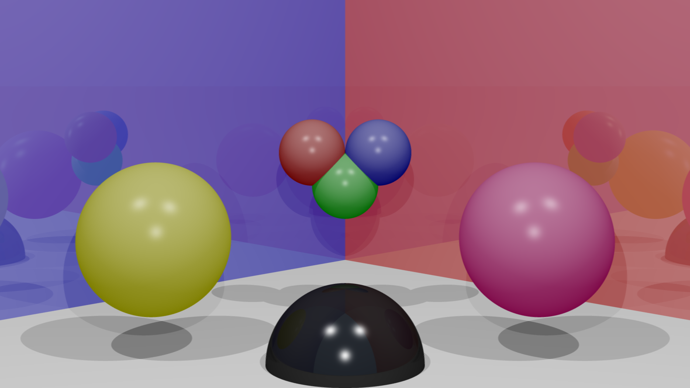
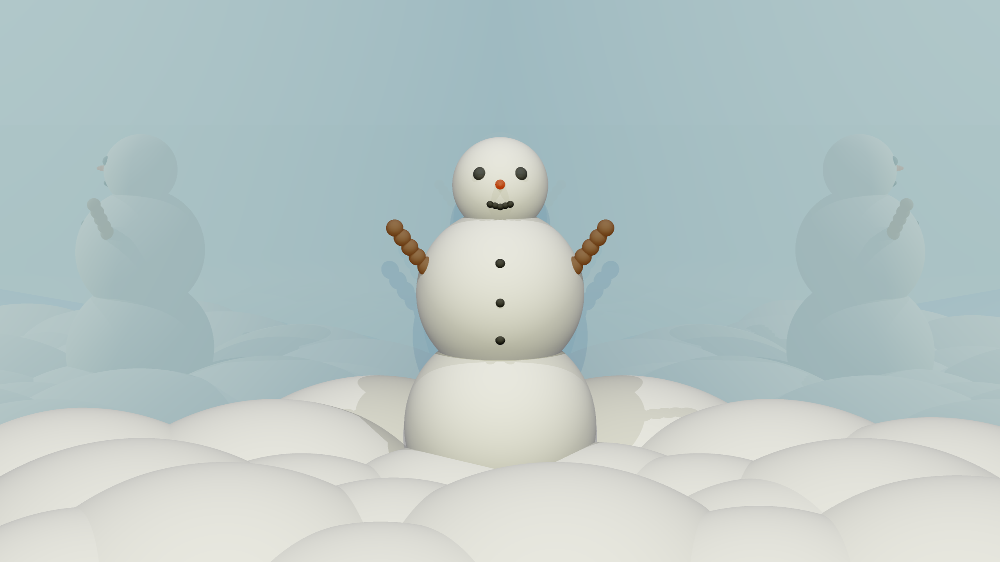

# Ray Tracer

_This version of the ray tracer is not yet complete and is still a work in progress_
---

<br/>

<p float="left">
   
   
</p>

<br/>


## Dependencies
The programm relies on the [_Eigen_](https://eigen.tuxfamily.org/index.php?title=Main_Page) library, [_OpenCV_](https://opencv.org/releases/) and the self written [_Statusbar_](https://github.com/finnsaile/Statusbar) library. When installing _OpenCV_, the **opencv2** folder has to be extracted from the **opencv4** folder. Otherwise the include statement has to be changed (didn't work on my machine for some reason). The ray tracer itself can be compiled using the [Makefile](Makefile).

## Usage
The programm can be run with up to two parameters. The first one being the _output_ filename and the second one being the _input_ filename containing information about the different entities. These default to _output.png_ and _entities.txt_ respectfully.

## Entities
For a scene there are 3 entities that _have_ to be defined in the entity file for the program to work: \
(To ignore an entity, simply change its name (e.g. _-camera_ instead of _camera_). \
_**The individual parameters of the entities have to be in the order in which they are listed.**_ <br/><br/>
**Camera:** \
The camera takes just one parameter, being the position (x y z).
```
camera
pos: 0 2.5 -30
```
<br/>

**Screen:** \
The screen takes a number of parameters.
1. The position (x y z) of the top left corner of the screen.
2. The normal vector of the screen (x y z).
3. The width and height (width height) of the screen.
4. The amount of pixels in x and y direction (x y).
5. Enables/disables Anti Aliasing.
   - 0 means AA is of and only one ray is cast per pixel. 
   - 1 means AA is on and 4 extra rays are cast per pixel.
  
**THIS FEATURE CAUSES THE RUNTIME TO GROW EXPONENTIALLY SO IT IS RECOMMENDED TO USE WITH CARE**
```
screen
pos: -2.5 5 -10
n: 0 0 1
w/h: 5 5
xr/yr: 1000 1000
aa: 1
```
<br/>

**Ambient Light:**
1. This is simply the color of the background (r g b) in values from 0 to 255. \
This currently has no influence on the color of the objects.
2. The maximum recursion depth for reflection and refraction.

```
ambient light
rgb: 128 179 255
mrd: 5
```
<br/> 

### In addition other scene objects can be defined

**Sphere:** \
This entity creates a sphere in the scene.
1. The center (x y z) of the sphere.
2. The color of the sphere (r g b) in values from 0 to 255.
3. The radius of the sphere.
4. The alpha value used for the _Specular Component_ of reflections.
5. For every light component intensity values (r g b) ranging from 0 to 1.
   - Ka: The _Ambient Component_. This however doesn't currently use the ambient light as color but the object color itself.  
   - Kd: The _Diffuse Component_.
   - Ks: The _Specular Component_.
   - Kr: The _Reflective Component_.
   - Kt: The _Refractive Component_. (Currently not implemented)
6. In addition to that, translations (trans: x y z), scalings (scal: x y z), and rotations (rot: (x/y/z) rad) can be written in the lines underneath. This feature is currently not working intuitivly.
```
sphere
pos: -1 3 0
rgb: 255 0 0
r: 1
alpha: 100
Ka: 0.4 0.4 0.4
Kd: 0.2 0.2 0.2
Ks: 0.6 0.6 0.6
Kr: 1 1 1
Kt: 1 1 1
trans: 1 1 1
scal: 2 2 2
rot: x 1.3
```
<br/>

**Half-Space:** \
This entity creates a half-space in the scene.
1. A point (x y z) located on the half-space.
2. The color of the half-space (r g b) in values from 0 to 255.
3. The normal vector of the halfspace going towards the outside (x y z).
4. The alpha value used for the _Specular Component_ of reflections.
5. For every light component intensity values (r g b) ranging from 0 to 1.
   - Ka: The _Ambient Component_. This however doesn't currently use the ambient light as color but the object color itself.  
   - Kd: The _Diffuse Component_.
   - Ks: The _Specular Component_.
   - Kr: The _Reflective Component_.
   - Kt: The _Refractive Component_. (Currently not implemented)
6. In addition to that, translations (trans: x y z), scalings (scal: x y z), and rotations (rot: (x/y/z) rad) can be written in the lines underneath. This feature is currently not working intuitivly.
```
halfspace
pos: 0 0 0
rgb: 255 255 255
N: 0 1 0
alpha: 1
Ka: 0.3 0.3 0.3
Kd: 0.2 0.2 0.2
Ks: 0.5 0.5 0.5
Kr: 1 1 1
Kt: 1 1 1
```
<br/>

**Light Source:** \
This entity creates a light source in the scene.
1. The positon (x y z) of the light source.
2. The color of the light source (r g b) in values from 0 to 255.
```
light source
pos: 15 40 -25
rgb: 255 255 255
```

